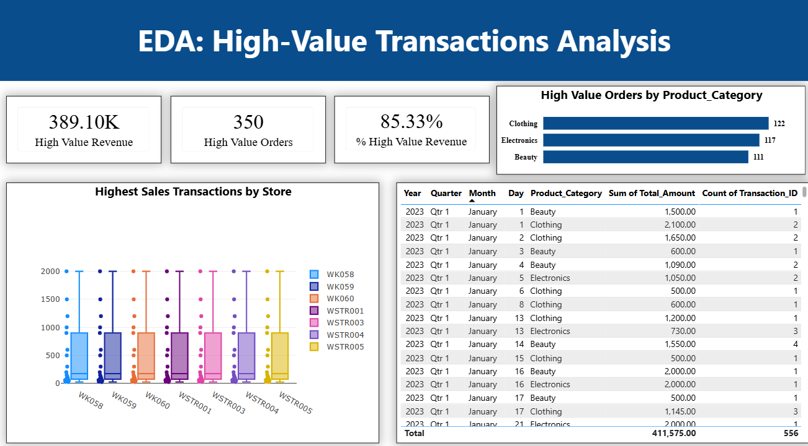
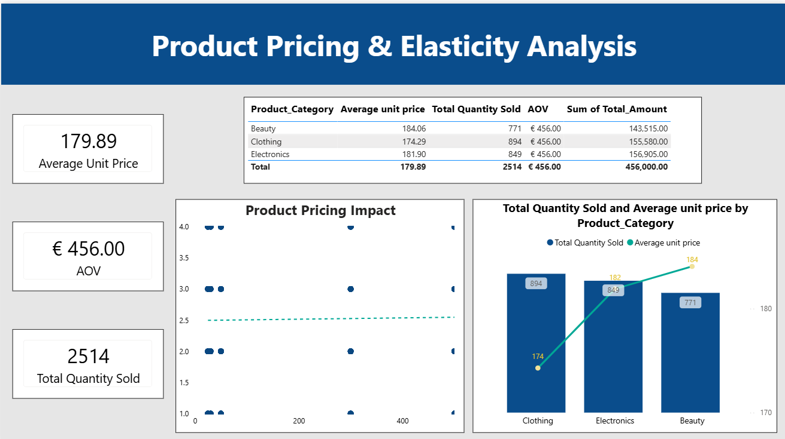
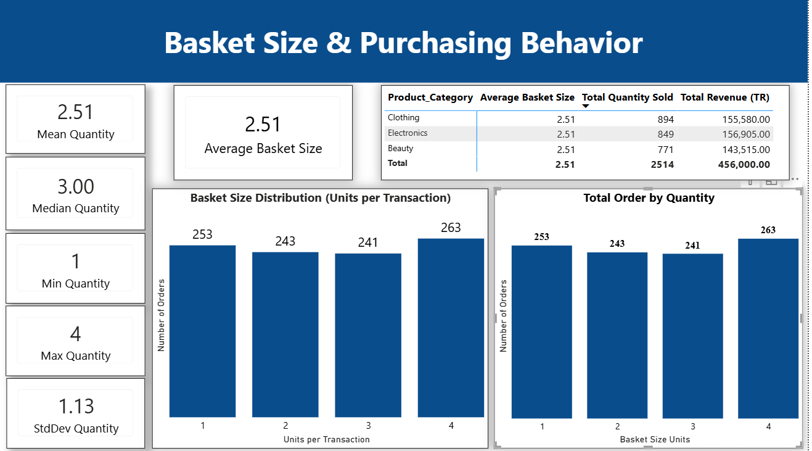
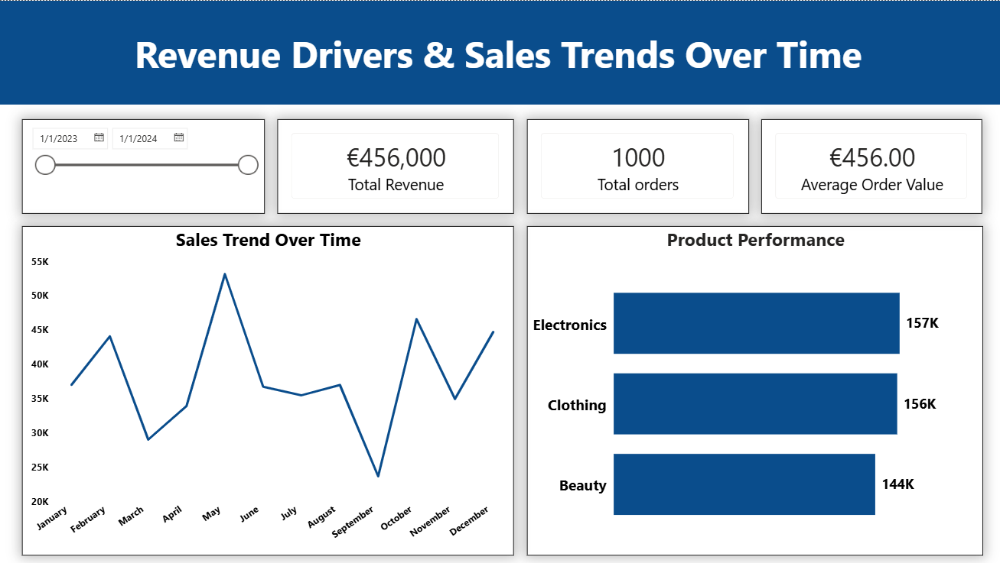
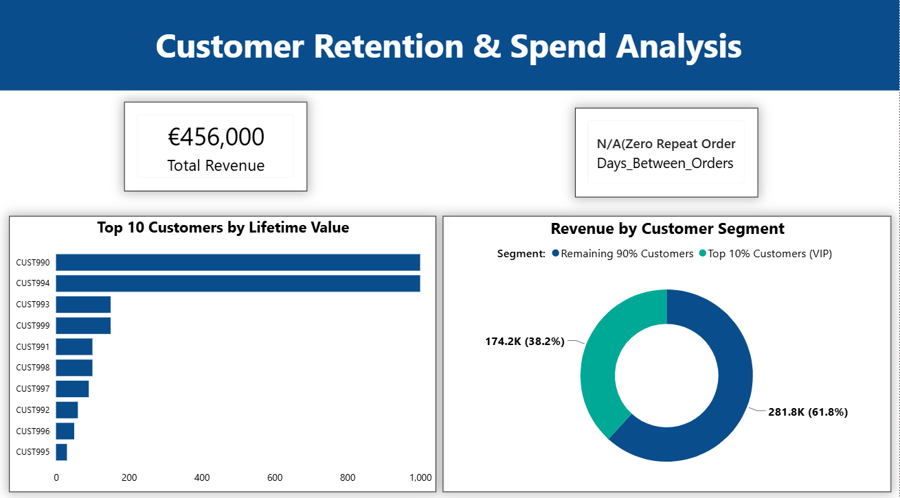

## End-to-End-Retail-Customer-Analytics

## Business Problem and Strategic Context:

This project evaluates retail sales performance, customer purchasing behavior, and pricing dynamics across **Beauty, Clothing and Electronics** categories in **Antwerp, Belgium** region. By combining public demographic data from Antwerp with commercial transaction records, this project delivers actionable results to optimize product margins, improve customer retention, and improve Average Order Value (AOV). 

## Key Strategic Findings & Recommendations:

* **Price Elasticity & Cross-Category Bundeling:** An inverse relationship has been observed between unit price and sales volume. Cross-category bundling **(e.g., Pairing high-margin Beauty products with high-volume Clothing products)** can drive higher total order value.
* **Basket Size & Multi-Order Purchasing:** Orders show consistent multi-order purchases pattern across all categories **(Average 2.51 Items per category)**. Multi-buy incentives **(e.g., Buy 3 & Get 4 at 20% off)** will further nudge 1- to 2- items buyers into higher tiers.
* **Seasonality & Demand Forcasting:** Clear annual sale seasonality are identified, peaking in May and Q4, with a sharp drop in October. Pre-planning inventory and promotional campaigns prior to high-demand months will prevent stock-out and better planning for low sale months.
* **Customers Concentration Risk (80/20 Rule):** The top 10% VIP customers generate **38.2% of total store revenue.** Targeted VIP loyalty programs for this high-value customer segment is crucial to safegaud revenue.

## Data Engineering & Analytical Workflow:

### **Step 1: Data Acquisition & Integration:**

Ingested official public demographic dataset from **OPEN DATA ANTWERPEN (Stad Antwerpen)** and integrated them with commercial retail transaction data from **Kaggle** to analyze regional market distribution and spending patterns. 

### **Step 2:Database Setup & Transformation:**

Loaded raw data into Azure SQL via SQL Server Management Studio (SSMS). Executed custom T-SQL transformation queries and database views to clean and structure data. 

### **Step 3: Data Profiling & Quality Check:**

Evaluated data quality by checking null values. However, data has no null values. Inconsistent types of data is given proper data type such as text, char, varchar, nchar, nvarchar, date. Duplicate records are removed in order to maintain the data integrity. 

### **Step 4: Data Modeling & Architecture:** 

Structured a normalized dimensional data model by separating reporting data into three dimension tables and one core fact table.

**Dimcustomer** (Customer Attributes)

**Dimdistrict** (Demography & Geography)

**Dimstores** (Stores locations)

**FactSales** (Core Transaction Metrics)

To maintain clean data integrity across regional stores, **Dimdistrict** serves as a normalized geographic dimension linked to **Dimstores**, feeding into the central **FactSales** engine.

### **Step 5: Relational Key Mapping:**

Assigned primary and foreign keys by establishing strict 1 to many relationships between dimension tables and fact table. 

## **Exploratory Data Analysis(EDA) & DAX Development:**

### **Step 6: Price & Elasticity Analysis:**

Built a scatter plot in PowerBI comparing 'Price_Per_Unit' against 'Quantity'. A linear trendline is applied through further analysis visual, proving a near-zero correlation and confirming an inelastic demand curve across core retail products. 

### **Step 7: Category Pricing & AOV:**

Created combo charts (line + Clustered Column) and financial summary tables to evaluate category revenue contribution. Developed DAX KPI measures. 

#### **DAX Measure**

                        - Average unit price = AVERAGE(FactSales[Price_per_Unit])
                        - Total Quantity Sold = SUM(FactSales[Quantity])
                        - AOV = DIVIDE([Total Revenue], [Total orders],0)

### **Step 8: Basket Size Statistical Profiling:**

Created quantity bins (sizes 1 through 4) using Power BI's grouping features. Computed core statistical metrics via DAX to evaluate transaction distribution.

#### **DAX Measure**

                        - Mean Quantity = AVERAGE(FactSales[Quantity])
                        - Median Quantity = MEDIAN(FactSales[Quantity])
                        - Min Quantity = MIN(FactSales[Quantity])
                        - Max Quantity = MAX(FactSales[Quantity])
                        - StdDev Quantity = STDEV.S(FactSales[Quantity])

### **Step 9: Category-Level Basket Behavior:**

Evaluated category basket consistency using Matrix tables and Bar charts, proving an identical 2.51 average basket size across Clothing, Electronics, and Beauty.

#### **DAX Measure**

                        - Average Basket Size = AVERAGE(vw_FactSales2[Quantity])

### **Step 10: Executive Sales Trends & Performances:**

Built continuous time-series line charts and horizontal bar charts to track monthly revenue patterns and product performance by category. KPI cards are included with slicers to observe the data in different time period. 

#### **DAX Measure**

                        - Total Revenue = SUM(vw_Factsales1[total_amount])
                        - Total orders = DISTINCTCOUNT(vw_Factsales1[transaction_id])
                        - Average Order Value = DIVIDE([Total Revenue],[Total orders],0)

## Advanced T-SQL Logic & Window Functions:

### **Step 11: Customer Revenue Segmentation (Decile Ranking):**

Used NTILE(10) window functions in SQL to calculate revenue concentration and isolate the top 10 VIP tier. 

#### **SQL**

                       - CREATE VIEW vw_Customer_Revenue_Concentration AS
                         WITH CustomerDeciles AS (
                           SELECT
                               Customer_ID,
                               Total_Amount,
                               NTILE(10) OVER (ORDER BY Total_Amount DESC) AS Decile
                           FROM FactSales
                         )
                         SELECT
                            CASE
                                WHEN Decile = 1 THEN 'Top 10% Customers (VIP)'
                                ELSE 'Remaining 90% Customers'
                              END AS Customer_Segment,
                              COUNT(Customer_ID) AS Total_Customers,
                              SUM(Total_Amount) AS Segment_Revenue,
                              ROUND((SUM(Total_Amount) / SUM(SUM(Total_Amount)) OVER()) * 100, 2) AS Revenue_Share_Pct
                         FROM CustomerDeciles
                         GROUP BY
                             CASE
                                WHEN Decile = 1 THEN 'Top 10% Customers (VIP)'
                                ELSE 'Remaining 90% Customers'
                             END;

### **Step 12: Customer Life-Time Value (CLV):**

Executed 'INNER JOIN' queries between Factsales and dimcustomer to identify top spenders profile. 

#### **SQL**

                        - SELECT TOP 10
                             c.Customer_ID,
                             SUM(s.Total_Amount) AS Customer_Lifetime_Value
                          FROM FactSales s
                          JOIN DimCustomer c
                             ON s.Customer_ID = c.Customer_ID
                          GROUP BY
                             c.Customer_ID
                          ORDER BY
                             Customer_Lifetime_Value DESC;

                          CREATE VIEW vw_Customer_Lifetime_Value AS
                          SELECT
                             Customer_ID,
                             SUM(Total_Amount) AS Customer_Lifetime_Value
                          FROM FactSales
                          GROUP BY Customer_ID;

### **Step 13: Retention Tracking & Purchase Gap:

Engineered a T-SQL query utilizing LAG() and DATEDIFF() to calculate the average repeat purchase interval.

#### **SQL**

                        - WITH CustomerOrders AS (
                             SELECT
                               Customer_ID,
                               Date,
                               LAG(Date) OVER (
                               PARTITION BY Customer_ID
                               ORDER BY Date
                               ) AS Previous_Order_Date
                             FROM FactSales
                          ),
                          OrderGaps AS (
                          SELECT
                             Customer_ID,
                             Date,
                             Previous_Order_Date,
                             DATEDIFF(day, Previous_Order_Date, Date) AS Days_Between_Orders
                            FROM CustomerOrders
                          WHERE Previous_Order_Date IS NOT NULL
                          )
                         SELECT
                            AVG(Days_Between_Orders) AS Avg_Days_Between_Purchases
                         FROM OrderGaps;

#### **Data Quality Insights:** 
The query returned NULL because every customer record currently contains exactly one order, indicating that customer repeat retention is 0% and highlighting a critical business opportunity for automated post-purchase marketing.

# 📊 Executive Dashboard & Portfolio Summary

## 1. Exploratory Data Analysis: High-Value Transactions

### 💰 Revenue Concentration & Category Balance
* **Revenue Concentration:** Purchases $\ge$ **€500** drive **85.33%** of overall business revenue (**€389.10K**), despite comprising only **35%** of total transaction volume (**350 orders**).
* **Category Balance:** High-value volume is evenly distributed across product lines: **Clothing** leads with **122** high-value orders, followed by **Electronics** (**117**) and **Beauty** (**111**).

### 📐 Statistical Distribution & Store Variance
* **Distribution Profile:** Sales data exhibits a right-skewed distribution, with lower order amounts forming the primary transaction cluster.
* **Central Tendency & Store Variance:** Median transaction values and interquartile ranges (IQRs) remain identical across all monitored stores (`WK058` through `WSTR005`), showing consistent regional performance network-wide.
* **Upper Ceiling:** Advanced SQL CTE ranking and box plot upper whiskers establish **€2,000** as the definitive high-value transaction cap across the network.

### 💡 Strategic Action Plan
* **VIP Loyalty & Retention Tier:** Implement automated post-purchase marketing and VIP incentives specifically targeted at the $\ge$ **€500** buyer segment to safeguard the core **85.33%** revenue base.
* **Cross-Category Up-Selling:** Utilize high-volume **Clothing** orders as the gateway to bundle and cross-sell higher-margin **Beauty** and **Electronics** items, pushing basket sizes toward the **€2,000** transaction ceiling.
* **Network-Wide Campaign Rollouts:** Deploy promotional strategies uniformly across all retail locations (`WK058`–`WSTR005`), avoiding unnecessary regional localization costs given the uniform store performance profile.

## 2. Exploratory Data Analysis: Product Pricing & Elasticity Analysis 

### 📈 Pricing & Elasticity Dynamics
* **Inelastic Demand Profile:** Transaction volumes remain stable across price points ranging from **€170 to €500**, indicating low price sensitivity among core customer segments.
* **Zero Correlation:** Trend line analysis confirms minimal volume decay relative to unit price increases, unlocking immediate margin optimization opportunities.
* **Order Clustering:** Transaction quantities consistently cluster between **1 and 4 units** per order across all price tiers.

### 🏷️ Category Performance & Revenue Metrics
* **Beauty:** Delivers the highest Average Unit Price (**€184.06**) with strong margin potential.
* **Electronics:** Drives core revenue (**€156,905**) through balanced volume and steady pricing.
* **Clothing:** Serves as a high-volume anchor (**€174.29** average unit price), capturing strong order frequency (**894 units sold**).

### 💡 Strategic Action Plan
* **Targeted Price Optimization:** Implement selective price increases on core, high-performing SKUs with minimal volume loss risk.
* **Cross-Category Bundling:** Pair high-margin Beauty products with high-volume Clothing items to boost overall Average Order Value (AOV).

---

## 3. Exploratory Data Analysis: Basket Size & Purchasing Behavior

### 🧺 Basket Size Distribution & Category Behavior
* **Balanced Demand Profile:** Customer order quantities demonstrate an even distribution across basket sizes, establishing a **2.51 unit** baseline average across all product categories.
* **Peak Volume Driver:** 4-unit transaction orders lead overall volume with **263 orders**, showing strong consumer willingness to make multi-item purchases.
* **Category Consistency:** The average basket size remains identical at **2.51 units** across Clothing (**894 units**), Electronics (**849 units**), and Beauty (**771 units**).

### 📐 Statistical Dispersion & Quantity Metrics
* **Central Tendencies:** Analysis confirms a Mean Quantity of **2.51**, a Median Quantity of **3.00**, and a Standard Deviation of **1.13 units**.
* **Quantity Range:** Transaction basket sizes span between a minimum of **1 unit** and a maximum cap of **4 units**.
* **Category Totals:** Electronics leads revenue contribution at **€156,905.00**, closely followed by Clothing at **€155,580.00** and Beauty at **€143,515.00** (Total Revenue: **€456,000.00** across **2,514 units**).

### 💡 Strategic Action Plan
* **Tiered Multi-Buy Incentives:** Implement targeted volume promotions (e.g., *"Buy 3, get the 4th at 20% off"*) to nudge single-unit (**253 orders**) and double-unit (**243 orders**) buyers toward 4-unit baskets.
* **Cross-Category Recommendations:** Capitalize on the uniform **2.51 unit** category baseline by embedding automated product recommendations at checkout to maximize Average Order Value (AOV).
* **High-Volume Threshold Marketing:** Focus promotional messaging around 4-unit bundling to align directly with existing consumer purchasing behavior.

## 4. Exploratory Data Analysis: Revenue Drivers & Sales Trends Over Time

### 📈 Revenue Drivers & Seasonal Sales Trends
* **Product Category Performance:** **Electronics** leads total revenue at **€157K**, followed closely by **Clothing** at **€156K**, while **Beauty** generates the lowest sales share at **€144K**.
* **Seasonal Peak Identification:** Monthly trend analysis highlights **May** as the annual peak sales month, accompanied by strong purchasing momentum in **February**, **November**, and **December**.
* **Autumn Trough Period:** Sales experience a sharp seasonal decline during **October**, identifying a key window requiring proactive demand generation.

### 📐 Macro Metrics & Category Dispersion
* **Portfolio Aggregates:** Total revenue generated across the monitored timeframe reaches **€456,000** across **1,000 total orders**.
* **Order Value Stability:** Average Order Value (AOV) stabilizes at **€456.00**, demonstrating high transaction consistency across seasons.
* **Category Variance:** Revenue distribution remains relatively balanced across all three categories, though Beauty trails top-performing Electronics by **€13K**.

### 💡 Strategic Action Plan
* **Beauty Growth Promotions:** Deploy targeted promotional campaigns and expand inventory selections within the Beauty sector to close the **€13K–€14K** revenue gap relative to Electronics and Clothing.
* **Q2 & Q4 Inventory Capitalization:** Align inventory stockpiling and promotional calendars to maximize revenue velocity ahead of peak demand spikes in **May** and the **Q4 holiday season (Nov–Dec)**.
* **October Demand Generation:** Launch mid-autumn flash sales and targeted multi-buy discounts specifically structured to mitigate the sharp **October** revenue slump.

## 5. Exploratory Data Analysis: Customer Retention & Spend Analysis

### 👥 VIP Revenue Concentration & Top Spender Baseline
* **Top 10% VIP Share:** The top 10% decile of customers (VIP segment) generates **€174.2K (38.2%)** of total revenue, highlighting strong value concentration among top accounts.
* **Mass Tier Balance:** The remaining 90% customer base accounts for **€281.8K (61.8%)** of total revenue, providing the baseline transactional volume.
* **Customer Lifetime Value (CLV) Peak:** Peak Customer Lifetime Value reaches **€1,000** per account (led by accounts `CUST990` and `CUST994`), establishing a benchmark profile for lookalike acquisition models.

### 🔄 Retention Tracking & Technical SQL Baseline
* **Repeat Purchase Metric:** Analysis executed via T-SQL window functions (`LAG`) identified **0% repeat orders** (`N/A / Zero Repeat Order` for `Days_Between_Orders`), confirming that every recorded customer currently possesses exactly 1 transaction.
* **Database Insight:** Inter-purchase interval calculations return null due to single-order transaction histories across the entire customer dataset, establishing an immediate operational priority for repeat-purchase workflows.
* **Macro Aggregates:** Overall portfolio revenue consolidates at **€456,000** across all analyzed customer profiles.

### 💡 Strategic Action Plan
* **Dedicated VIP Account Loyalty:** Roll out exclusive retention perks, direct account management, and tailored VIP incentives to the top 10% decile to safeguard the **38.2% (€174.2K)** revenue anchor.
* **Automated Post-Purchase Lifecycle Sequences:** Build automated email nurture sequences triggered immediately post-checkout to convert single-order accounts into repeat buyers and reduce `Days_Between_Orders`.
* **Lookalike Audience Targeting:** Leverage account characteristics of top spenders (`CUST990`, `CUST994`) to refine paid acquisition targeting toward prospective high-CLV profiles.
Instructions for GitHub:
